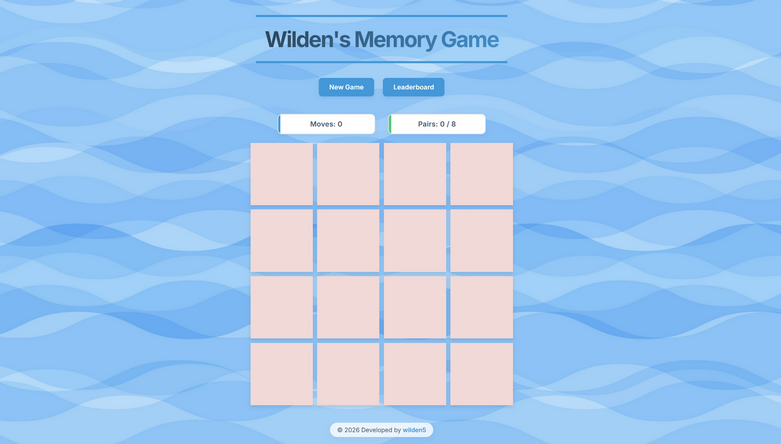

# Wilden's Memory Game



An interactive card-matching game (Memory Game) developed as part of the **RS School** front-end development course.

The player needs to flip cards, remember their positions, and find all matching pairs in the fewest number of moves.

## Deploy Link
[GitHub Pages Demo](https://wilden5.github.io/memory-game/)

## Tech Stack
- HTML5
- CSS3
- JavaScript
- Vite

## Local Setup Instructions

To run this project locally, you need to have [Node.js](https://nodejs.org) (LTS version recommended) and npm (node package manager) installed on your computer.

1. **Clone the repository:**
   ```bash
   git clone https://github.com/wilden5/memory-game.git
   ```

2. **Install dependencies:**
   ```bash
   npm install
   ```

3. **Start the development server:**
   ```bash
   npm run dev
   ```
   *Once started, the terminal will provide a local link (`http://localhost:5173/memory-game/`). Copy and open it in your browser.*
